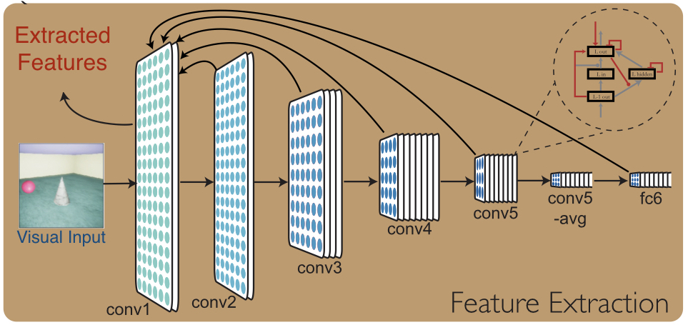

# Physical Scene Graph Network
This repo is trying to reproduce the project "Learning Physical Graph Representations from Visual Scenes". Apply Gestalt principles in unsupervised 
visual scene understanding.
Computer vision researchers have not yet developed algorithms that capture human physical understanding of scenes. This is despite outstanding progress in capturing other visual abilities: in particular, convolutional neural networks(CNNs) supervised with human-labeled data have excelled at categorizing scenes and objects. Yet when CNNs are optimized to perform tasks of physical understanding, such as predicting how a scene will evolve over time, the may unrealistic predictions - of objects dissolving, disappearing, or merging. Being able to tell a cat from a dog is not the same as knowing that a dog will still exist and keep its form when it runs out of sight.

[[Paper]](https://arxiv.org/pdf/1904.11694.pdf)
[[Project Page]](https://sites.google.com/view/neural-logic-machines)

When we look at a scene we see distinct object imbued with *physical properties*: color, texture, location, shape, motion, and so on. We also infer complex and dynamical relationships within the scene: a cup may be balanced precariously on table's edge, a piece of debris may be rolling in front of a truck, or a dog may have temporarily disappeared behind a tree. All of these judgements involve physical understanding of out visual observations.

## Representation of Physical Scene Graph

The need to understand physical objects suggests a different type of scene representation than the image-like layers of features found in CNNs. Instead, different objects might be represented by distinct entities with associated attributes and interelationships--in other words, a graph representation. We formalize this idea as a Physical Scene Graph (PSG): a hierarchical graph in which nodes represent objects or their parts, edges represent relationships, and a vector of physically meaningful attributes is bound to each node,
## Visual Feature Extraction

Of course I didn't write the ConvRNN in the repo because I didn't find the pytorch version for this network. I used a residual dense network to replace the feature extractor and it looks fine.

## Cluster and Graph Pooling


The general framework for the graph pooling and clustering layer is here. Different layers have different kinds of grouping mechansim that corresponds to gestalt principles which will be discussed in detail later.

```py
def forward(self, x, edge_index, batch, device=device):
    row, col = edge_index
    # Collect affinities/thresholds to filter edges 

    affinities, threshold, losses = self.affinities_and_thresholds(x,row,col)

    if self.Type == "P1":filtered_edge_index = edge_index[:, affinities <= threshold]
    if self.Type == "P2":filtered_edge_index = edge_index[:, affinities >= threshold]
            
    # Coarsen graph with filtered adj. list to produce next level's nodes
    x = x.to(device)

    if x.size(0) != 0:
        try:
            node_labels    = LP_clustering(x.size(0), filtered_edge_index, 40).to(device)
        except:
            node_labels = torch.arange(x.size(0))
    else:
        node_labels = torch.arange(x.size(0))
        

    cluster_labels = node_labels.unique(return_inverse=True,sorted=False)[1].to(device)

    coarsened_x, coarsened_batch = max_pool_x(cluster_labels, x, batch)

    # [Very Suceptible Step, Why use this way to coarse edges]
    coarsened_edge_index = coalesce(cluster_labels[filtered_edge_index],
                              None, coarsened_x.size(0), coarsened_x.size(0))[0]

    return (coarsened_x, coarsened_edge_index, coarsened_batch,
                                                         cluster_labels, losses)
```


Four types of graph cluster methods are introduced in the paper. Here are some implemenatations of these concepts.

**Principle-1**:This is the implementation for the principle-1 of visual grouping. 
```py
def affinities_and_thresholds(self, nodes, row, col):
    # Norm of difference for every node pair on grid
    edge_affinities = torch.linalg.norm(nodes[row] - nodes[col],dim = 1) 

    # Inverse mean affinities for each node to threshold each edge with
    inv_mean_affinity = scatter_mean(edge_affinities, row.to(nodes.device))
    affinity_thresh   = torch.min(inv_mean_affinity[row],
                                      inv_mean_affinity[col])
    return edge_affinities.to(device), affinity_thresh.to(device), {}
```

**Principle-2**:This is the implementation for the principle-2 for visual grouping. This layer corresponds to the gestalt principle of statistical cooccruence.
```py
self.node_pair_vae = VAE( in_features=node_feat_size ,beta = 30) # layer specified

def affinities_and_thresholds(self, x, row, col):

    # Affinities as function of vae reconstruction of node pairs
    _, recon_loss, kl_loss = self.node_pair_vae( x[row] - x[col] )
    edge_affinities = 1/(1 + self.v2*recon_loss)

    losses = {"recon_loss":recon_loss.mean(), "kl_loss":kl_loss.mean()}

    return edge_affinities, .5, losses
```

The `jnp.einsum` op provides a DSL-based unified interface to matmul and
tensordot ops.
This `einshape` library is designed to offer a similar DSL-based approach
to unifying reshape, squeeze, expand_dims, and transpose operations.

Some examples:

* `einshape("n->n111", x)` is equivalent to `expand_dims(x, axis=1)` three times
* `einshape("a1b11->ab", x)` is equivalent to `squeeze(x, axis=[1,3,4])`
* `einshape("nhwc->nchw", x)` is equivalent to `transpose(x, perm=[0,3,1,2])`
* `einshape("mnhwc->(mn)hwc", x)` is equivalent to a reshape combining
  the two leading dimensions

## Graph Node Render
This paper use the quadratic texture rendering and quadratic shape rendering to output the reconstruction signal and segmentation signal. In this repo, after each layer' nodes' attributes are calculated, we implement a fully connected network to decode the parameters for the final rendering.

**Quadratic Texture Rendering**
Give the node attributes of layer of a PSG,$ V_l,A_l $, together with the spatial registration (spatial region) $R_l$ it corresponds, the quadratic texture rendering (**QTR**) creates a spaitial map by inpaining the value of an attribute for node $v$ onto the pixels in $R_l(v)$. However, rather than paint uniformly throughout $R_l(v)$, QTR paints quadratically. Given 6 parameters of a quadratic form $a,a_h,a_w,a_{hh},a_{ww},a_{hw}$, it paints the corresponding spatial registration using the form $a+a_h(i-c^v_h)+a_w(j-c^v_w)+\frac{1}{2}(j-c^v_h)^2+\frac{1}{2}$.

## Furture Prediction
The key next step is to use the physical graph representation for tasks that flummox other computer algorithms - tasks that require physical understanding more than categorical knowledge. Whether an object will slide or roll, how soon two things will collide, and where to look for something hidden are problems that depeond on just the sort of scene structure and physical properties that PSGNets encoder. By learning to build structure, physical representations of scenes, we hope that PSGNets will begin to bridge the critical gap between visual perception and physical understanding.


## Results
Here are some results collected in the scene.

## Usage

Jax version:

```py
from einshape import jax_einshape as einshape
from jax import numpy as jnp

a = jnp.array([[1, 2], [3, 4]])
b = einshape("ij->(ij)", a)
# b is [1, 2, 3, 4]
```

## Future Works
This project contains.